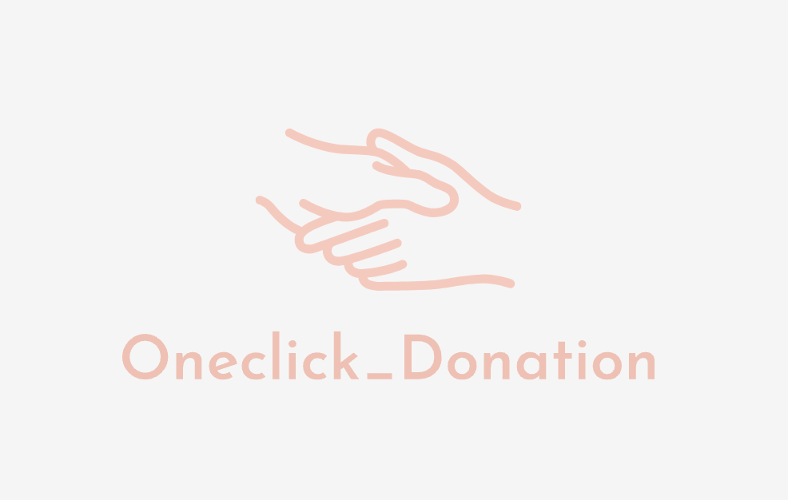
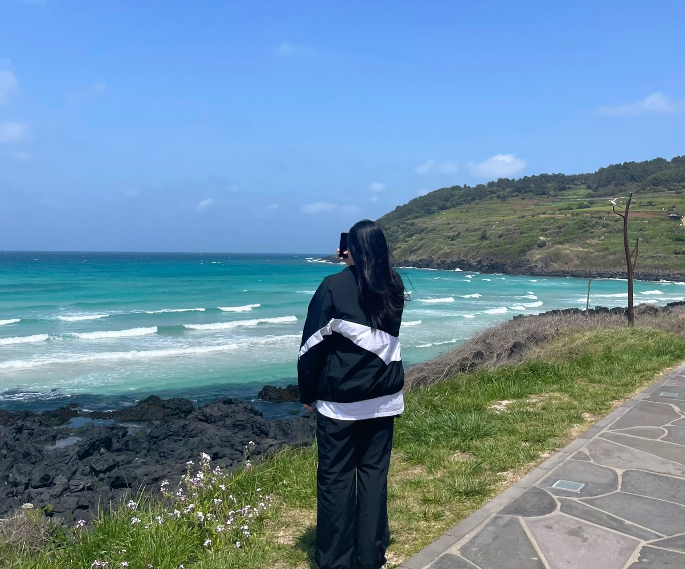
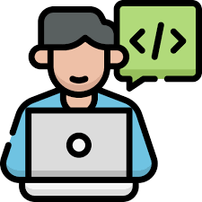
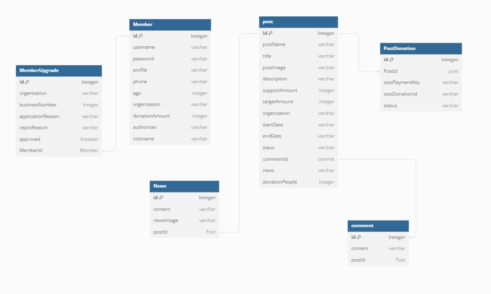
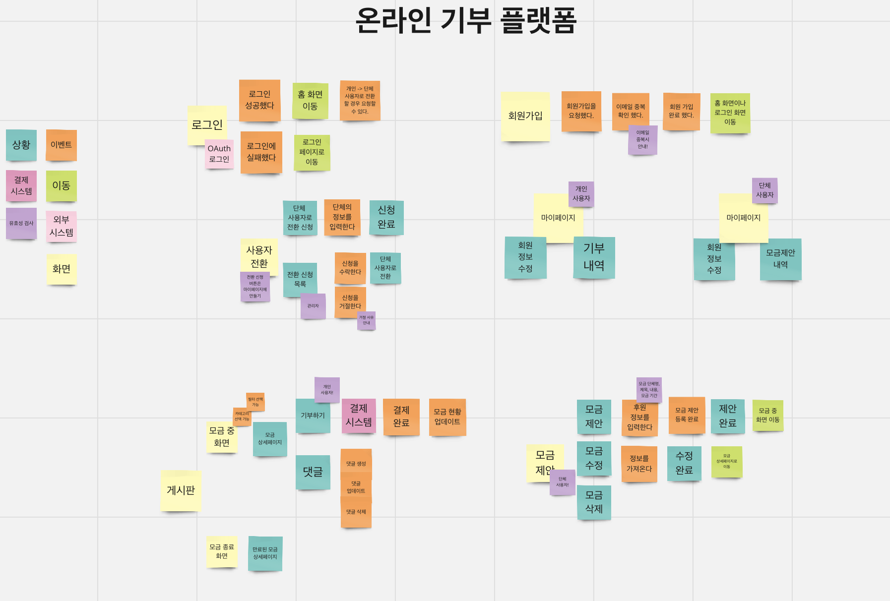
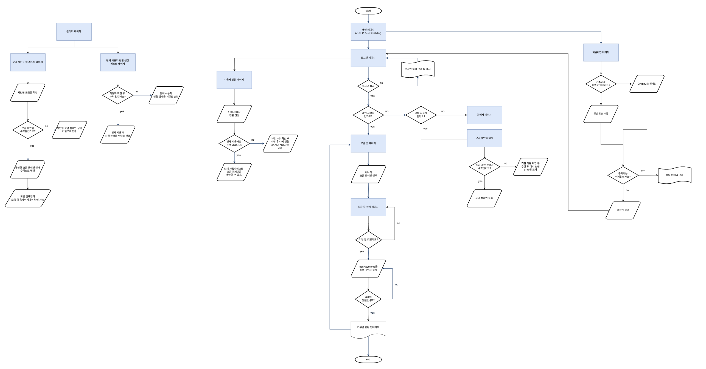

> **[LIKELION]** TECHIT BACK-END SCHOOL 8기

- 프로젝트 기간: 2024.03.13 ~ 2024.04.04
- Team: Oneclick_Donation 🤍

### 🎖️  팀원 소개

 
<table>
    <tr>
        <td align="center">
            
                
        </td>
        <td align="center">
            
        </td>
        <td align="center">
            
        </td>
        <td align="center">
            
        </td>
    </tr>
    <tr>
        <td align="center">
            <b>김소은</b>
        </td>
        <td align="center">
            <b>박주윤</b>
        </td>
        <td align="center">
            <b>정치헌</b>
        </td>
        <td align="center">
            <b>김기현</b>
        </td>
    </tr>
  <tr>
        <td align="center">
            <b>팀장</b>
             
            - 회원가입  
            - 관리자  
            - Toss API  
            - 프론트 
        </td>
        <td align="center">
            <b>팀원</b>
             
            - 모금 제안  
            - 캠페인 소식  
            - 게시판 기능  
            - 프론트 
        </td>
        <td align="center">
            <b>팀원</b>
             
            - 마이페이지
        </td>
        <td align="center">
           <b>팀원</b>
             
            - 로그인  
            - OAuth2
        </td>
    </tr>
</table>

 

---

### ✨ 프로젝트 소개

- `Oneclick_Donation`은 경제에 기여하기 위한 프로젝트로 기부자와 수혜자 간의 연결을 강화하고, 기부 과정을 투명하고 효율적으로 만들기 위해 만들어 졌습니다. 
- 이 서비스는 기부자가 쉽게 기부할 수 있는 결제 시스템과 기부 캠페인을 관리할 수 있는 기능을 제공하여, 기부 문화를 활성화하고 사회적 가치를 창출하는 것을 목표로 합니다.

### 👩🏻‍💻 기술 스택 

#### &nbsp;　[ DB ]
&nbsp;&nbsp;&nbsp; 

#### &nbsp;　[ Backend ]

&nbsp;&nbsp;&nbsp; &nbsp;&nbsp;&nbsp; &nbsp;&nbsp;&nbsp; &nbsp;&nbsp;&nbsp;&nbsp;&nbsp;&nbsp;

#### &nbsp;　[ Frontend ]

&nbsp;&nbsp;&nbsp;&nbsp; &nbsp;&nbsp;&nbsp;&nbsp;&nbsp;&nbsp;&nbsp;&nbsp;&nbsp;&nbsp;&nbsp;&nbsp;

#### &nbsp;　[ Etc... ]

&nbsp;&nbsp;&nbsp;&nbsp; &nbsp;&nbsp;&nbsp;&nbsp;

### 📝 프로젝트 설계 및 기획

<strong>ERD</strong>

 

<strong>이벤트 스토밍</strong>

 

<strong>구조도</strong>

