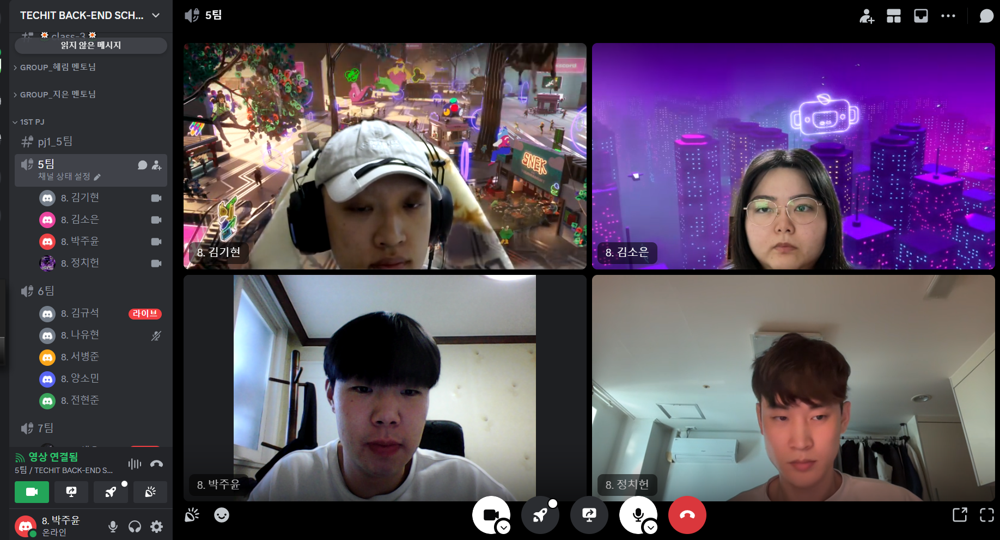

# [1주차] Project_5팀 진행상황 공유

## 팀 구성원, 개인 별 역할

---

김소은(팀장)
기획, 개발

김기현(팀원)

기획, 개발

박주윤(팀원)

기획, 개발

정치헌(팀원)

기획, 개발

## 팀 내부 회의 진행 회차 및 일자

---

1회차(2024.03.13)

- 주제 선정, 기획서 작성, 자료 탐색, 기능에 대한 논의

2회차(2024.03.14)

- 아이디어톤 발표자료 작성, 요구사항 작성, 도메인 설계, 역활 분담

3회차(2024.03.14)

- ERD 생성, 프로젝트 Dependencies 주입후 생성, 발표자료 검토, 강사님 질문 준비, ERD 수정

## 현재까지 개발 과정 요약 (최소 500자 이상)

---
전체적인 개발 과정은 현재 ERD 구성을 완료하였고, 추가적인 구성은 프로젝트 개발을 하면서 진행이 될 것 같다. 큰 그림으로 봤을 때 구성을 어떻게 가져가면 좋을지에 대한 이야기를 
중점으로 이야기를 많이 나누었고, 나오는 이야기들을 가지고 어떻게 구현할 수 있을지에 대해서도 이야기해보는 시간들을 가졌다.

- 김소은

  처음에 주제를 선택하는 것에서 어떤 주제를 선택해야 우리가 배웠던 기본적인 기술들부터 최근에 배웠던 기술들까지 활용할 수 있을까 그리고 기술을 활용함에 있어서 제대로 구현 할 수 있을까라는 생각으로 주제를 정하였습니다. 주제를 선정한 이유에는 처음에 선정한 이유에 들어있던 기술들을 포함해서 더 만들어 낼 수 있는 기술들이 무엇이 있는지 고민하는 시간을 가졌습니다. 그 이후 생각한 기술들이 어떤 흐름으로 진행이 될지에 대한 고민을 했어야했는데 그것들 사이사이의 과정들을 나타내는게 쉽지 않았습니다.

- 김기현

  주제를 선정하고 프로젝트를 진행하기 앞서 기획을 하면서 구현해야 할 기능을 작성하고 어떤 기술들이 사용되는지 생각 하는 부분이 많이 있었고 처음 만들어보는 플로우차트 역시 익숙하지 않아 어려웠습니다.

- 박주윤

  주제 선정, 기획서 작성, 관련 자료 탐색과 등 프로젝트를 처음부터 기획할 때 준비해야 할 과정이 많다는 것을 느꼈다. 특히 어떤 서비스를 구현할지 주제를 정하는 과정과 이후 개발 방향을 잡기 위해 플로우차트를 활용하는 부분에서 어려움을 있었다.

- 정치헌

  개발단계에 들어가지도 않았는데 기획에서부터 어려움이 많았다. 대략적으로 어떤 기능을 추가해야할지 얘기해보았는데 어떤 기술을 써야할 지 막막했다. 프론트도 어느정도 필요한 터라 크게보고 하나씩 좁혀나가야할 듯 싶다.

## 개발 과정에서 나왔던 질문 (최소 200자 이상)

--- 

- 개발하는 과정에서 역할 분담을 어떻게 하면 좋을지
- 여기서 추가하면 좋을 것 같은 기능은 뭐가 있는지 추천
- 프로젝트 진행에 대한 전체적인 흐름에 대해 물어보기
- 마이페이지에서 개인 사용자와 단체 사용자의 내용이 다른데
  페이지를 따로 나누는게 좋은지 아니면 하나의 페이지에서 다른 내용을 보여주면 좋은지(다르게 보여주어야되는거에서 어떻게 해야될지 모르겠음)
- 관리자를 만들고 싶은데 처음에 관리자 사용자를 지정하는 방법?
- 아이디어 구현을 위한 기술에 토스페이먼트와 OAuth도 포함이 되는지
- 프론트 측면에서 고민
- 깃 브런치 생성 후 코드 올리는 부분에서 push failed하여 어떻게 진행하였는지

## 개발 결과물 공유

---

Github Repository URL: [https://github.com/likilion-8t](https://github.com/likilion-8th)
