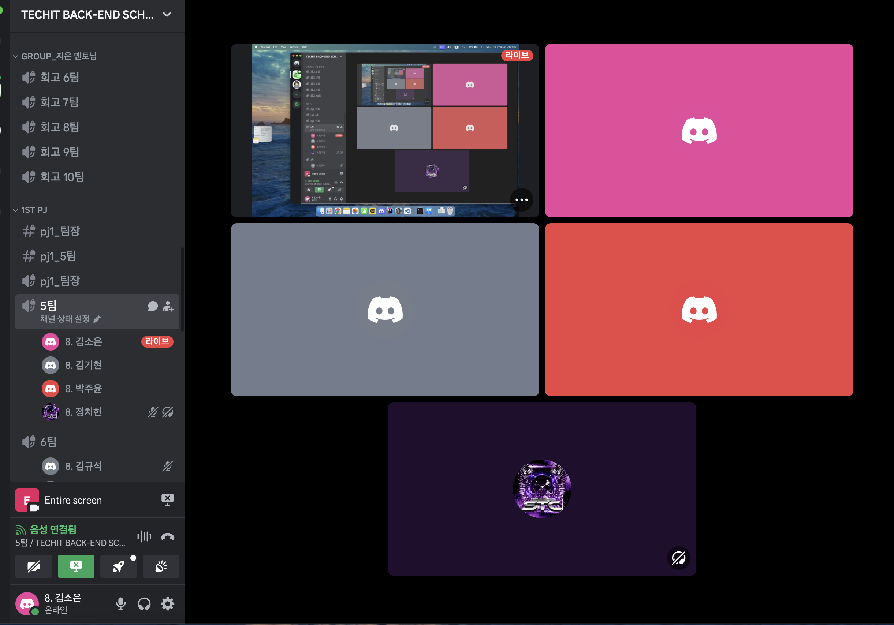

# [2주차] Project_5팀 진행상황 공유

## 팀 구성원, 개인 별 역할

---

**김소은(팀장)**: 기획, 회원가입, 사용자 전환, 홈 페이지

**김기현(팀원)**: 기획, 로그인, OAuth2

**박주윤(팀원)**: 기획, 모금관련 CRUD

**정치헌(팀원)**: 기획, 마이페이지 

## 팀 내부 회의 진행 회차 및 일자

---

4회차(2024.03.18) 아이디어톤

5회차(2024.03.19) 디스코드 음성,채팅 진행

6회차(2024.03.20) 디스코드 음성,채팅 진행

7회차(2024.03.21) 디스코드 음성,채팅 진행 (김기현님 오후 불참)

8회차(2024.03.22) 디스코드 음성,채팅 진행

## 현재까지 개발 과정 요약 (최소 500자 이상)

---

- 김소은

  회원가입 기능 및 페이지 구현 완료, 메인 홈페이지 기본 틀 제작 단계, 사용자 전환 기능과 관리자 전환 수락/거절 기능 구현했지만 테스트 진행 못해서 이번주 중으로 진행 예정입니다.
  추가로 이번주에 관리자 홈페이지도 만들고 싶습니다.

- 김기현

  현재 로그인 기능은 구현 했으나 로그인시 토큰이 안들어오는 부분을 해결하고 있음 또 수업시간에 사용자 정보를 받은뒤 URL 리다이렉트 하도록 만들었는데 포스트맨을 사용하지않고 홈페이지로 만드려하니 어려움이 있었다.

- 박주윤

  현재 post 부분에서는 모금 제안하기, 조회하기, 수정하기, 삭제하기의 기능은 다 구현하였으나 프론트 부분은 아직 구현하지 못하였다.
  또한 모금 제안하기에서 파일을 첨부하여 생성했을 때 프로젝트 안에 이미지 파일은 들어오지만 게시글을 조회 페이지에서
  이미지를 불러오지 못하는 오류를 해결 중이다. 이후 권한에 따른 기능 제한하기, 게시글 상세페이지 내에 댓글 기능 등을 구현할 계획이다.

- 정치헌

  프론트 부분을 간단히 구현하였고, 회원가입 후 로그인, 로그인 한 사용자의 데이터를 가져와 표시하는 부분에 어려움이 있다. 여러가지 시도를 해보며 해결중이다.

## 개발 과정에서 나왔던 질문 (최소 200자 이상)

--- 

- 모금 제안하는 기능에서 모금 기간 정보도 기입을 해야하는데 프론트 쪽에서 어떻게 넣어야하는지 (완료)
- 모금 제안하는 과정에서 대표 이미지를 넣으면 파일에는 들어오지만 페이지에서는 이미지가 보이지 않고, 이미지 제목으로 보인다. (해결 X)
- 회원가입 했을때의 정보를 가져와서 해당 로그인 유저의 정보를 그대로 가져오는법 (진행 중)
- 지금하고 있는 merge방법이 맞는 방법인지?security config에서 자주 충돌이 일어난다. (해결)
- 관리자를 미리 만들어 놓고, 실행을 시키면 관리자는 이미 있는 상태에서 진행을 해도 되는지 (해결)
- 로그인 할 때 jwt를 프론트 쪽에서 해더로 전송을 해야하는지 (진행 중)
- 숫자를 넣는 곳에 한글을 넣어도 들어가는데 해결방법 (진행 중)

## 개발 결과물 공유

---

Github Repository URL: [https://github.com/likelion-backend8th-5team/Oneclick_Donation](https://github.com/likelion-backend8th-5team/Oneclick_Donation)
`