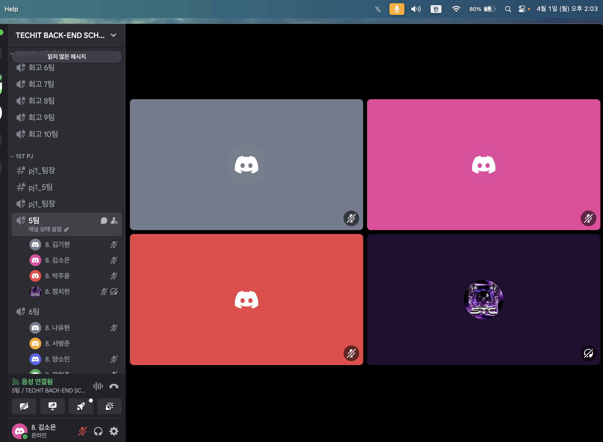

# [3주차] Project_5팀 진행상황 공유

## 팀 구성원, 개인 별 역할

---

**김소은(팀장)**: 기획, 회원가입, 사용자 관리, 결제 

**김기현(팀원)**: 기획, 로그인, OAuth2

**박주윤(팀원)**: 기획, 모금관련 CRUD, 홈 페이지 

**정치헌(팀원)**: 기획, 마이페이지 

## 팀 내부 회의 진행 회차 및 일자

---

9회차(2024.03.26) 디스코드 음성,채팅 진행 

10회차(2024.03.27) 디스코드 음성,채팅 진행 (정치헌님 예비군 불참)

11회차(2024.03.28) 디스코드 음성,채팅 진행 (정치헌님 예비군 불참)

12회차(2024.03.29) 디스코드 음성,채팅 진행 (정치헌님 14시 조퇴) 

## 현재까지 개발 과정 요약 (최소 500자 이상)

---

- **김소은**

  - 관리자 홈페이지 토큰 이동과 관리자 전환 신청 수락 기능 구현 완료, 거절 기능 구현 중
  - post 더미 데이터 만들고 데이터의 사진들이 불어오는 것까지는 완료했지만 새로 업로드한 이미지를 불러오는 것은 안되는 오류가 있다.
  - 기부할 수 있는 toss 결제 시스템을 구현해하고 있는데 캠페인 페이지에서 기부하기 클릭 시 기부 결제창으로 가도록 하고있는데 그 페이지를 불러오지 못하고 있다.

- **김기현**

  - 로그인 요청시 jwt토큰을 발급하고 클라이언트 로컬스토리지에 토큰저장 한뒤 헤더에 담아서 서버에서 검증 기능 구현 하는 문제 해결 현재 소셜로그인 Naver-api 설정 완료 로그인 요청시 토큰 값이 들어오지 않는 문제 해결중

- **박주윤**

  - 현재 post 부분에서는 모금 제안하기, 조회하기, 수정하기, 삭제하기의 기능과 프론트 부분을 거의 다 구현하였다. 또한 작성한 게시글이
    홈화면에서 박스 안에 정렬되어 보이도록 하였으나 아직까지 파일을 첨부한 게시글은 이미지를 불러오지 못하는 오류를 해결하지 못 하였다.
    프론트 부분에 대한 지식이 미숙해서 인지 구현할 때 생각보다 기능보다 프론트 부분에서 시간이 오래 걸린다는 것이 느껴졌다.현재 post 부분에서는 모금 제안하기, 조회하기, 수정하기, 삭제하기의 기능과 프론트 부분을 거의 다 구현하였다. 또한 작성한 게시글이
    홈화면에서 박스 안에 정렬되어 보이도록 하였으나 아직까지 파일을 첨부한 게시글은 이미지를 불러오지 못하는 오류를 해결하지 못 하였다.

- **정치헌**

  - 데이터를 가져오는 부분은 다 구현하였는데 이미지 불러오기와 프론트 구현에서 어려움이 있다. 단체사용자 전환 등 여러가지를 한번에 하려고 억지로 시도하다보니 오류가 많이 난 상태라 수정중이다.

## 개발 과정에서 나왔던 질문 (최소 200자 이상)

--- 

- 소셜 로그인으로 로그인은 구현했지만 회원가입 방법
- jpa.ddl-auto: update 오류(해결: member의 username컬럼을 unique = true로 해놨는데 이미 만들어두었던 테스트 사용자들이 있어 충돌이 일어나 update 설정이 안되는거였다.)
- 게시글 파일 첨부하여 생성 후 조회 시 이미지 불러오지 못하는 오류(해결X : 현재 미리 저장해둔 이미지들을 불러와지는데 새로운 이미지는 불러와 지지 않는다.)
- WebSecurityConfig의 .hasRole()에 설정 오류(해결X: API를 이용하여 관리자 홈페이지로 이동하면 토큰 받아 역할을 받아오는것까지 진행이 되지만 관리자 홈페이지의 html이 보이지 않고, Response에는 응답하는 상황이다.)
- 결제 시스템을 어떻게 사용할 것인가

## 개발 결과물 공유

---

Github Repository URL: [https://github.com/likelion-backend8th-5team/Oneclick_Donation](https://github.com/likelion-backend8th-5team/Oneclick_Donation)
`